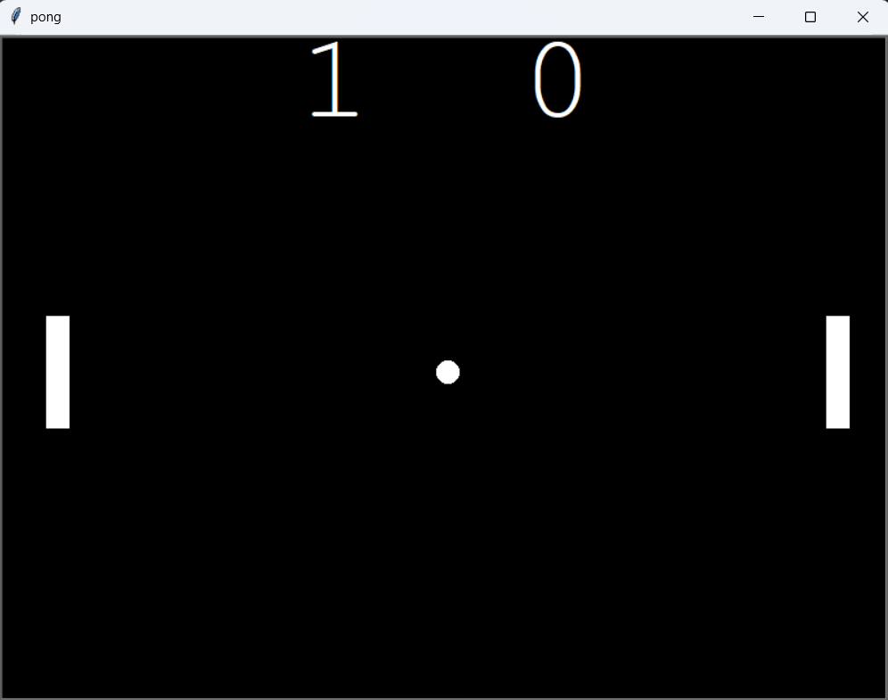

# Pong Game 🏓

A two-player **Pong Game** built using Python's `turtle` graphics module.  
This project recreates the classic Pong arcade game where two players control paddles to bounce a ball back and forth.  
It’s built using **object-oriented programming (OOP)** concepts like classes and methods.

---

## 🎮 Features
- Two-player mode (Right Paddle → Arrow Keys, Left Paddle → W/S keys)
- Realistic ball bounce and paddle collision
- Dynamic ball speed increase after each hit
- Scoreboard tracking for both players
- Smooth animation using `time.sleep()` and `screen.tracer(0)`

---

## 🧩 Game Controls
| Player | Move Up | Move Down |
|:--------|:---------|:-----------|
| Left Paddle | **W** | **S** |
| Right Paddle | **Up Arrow** | **Down Arrow** |

---

## 🖼️ Screenshot


---

## 🚀 How to Run
1. Clone the repository:
   ```bash
   git clone  https://raghul2112.github.io/Pong_Game/

